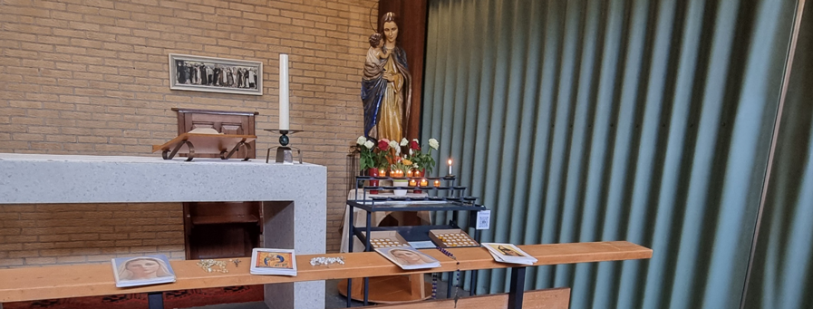
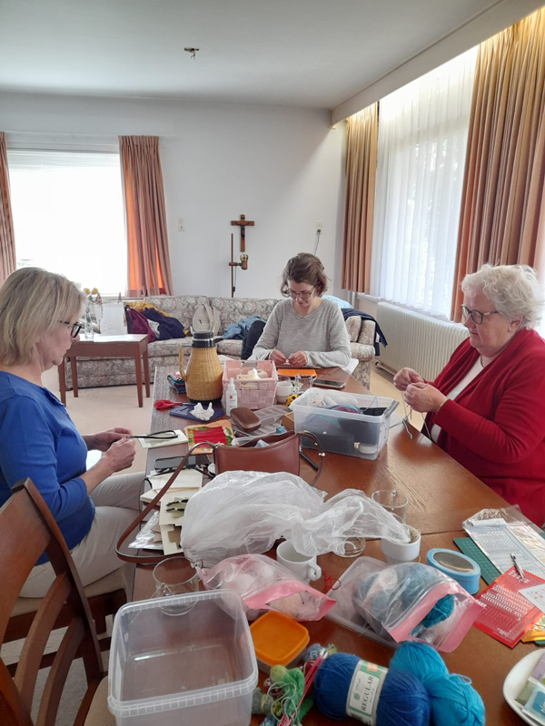
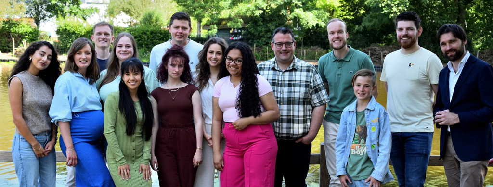
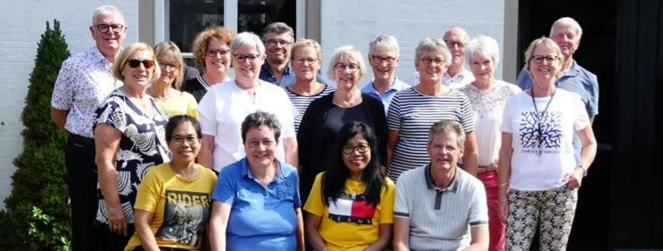
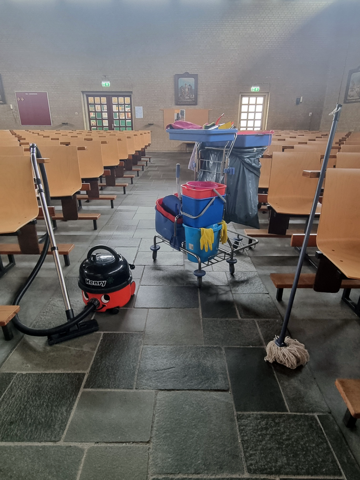
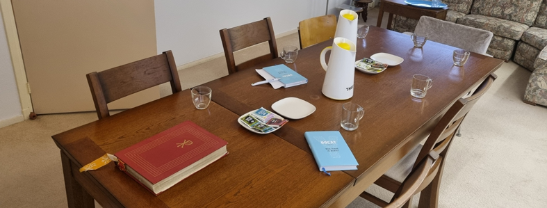
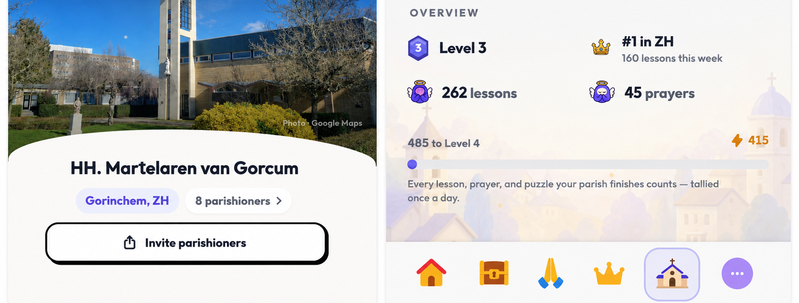

---
hide:
  - navigation
  - footer
  - toc
---

# Activiteiten

  

    Hieronder ziet u een overzicht van verschillende activiteiten in en rondom onze parochie.
  

  

    

      

        <h3>Gebedsgroep</h3>
        
Elke 1e zaterdag — 10:00

        
In de gebedsgroep komen we bij elkaar om de rozenkrans te bidden voor de priesters.

      

      

        
      

    

    

      

        <h3>Creativiteit</h3>
        
Donderdag — 10:00 - 12:00

        
Breien, haken, en diverse andere activiteiten. We maken dingen om te kunnen verkopen voor een goed doel.
        

      

      

        
      

    

    

      

        <h3>Tutti, jongerenkoor</h3>
        
Vrijdag — 20:15 - 22:15

        
Tutti is een katholiek jongerenkoor uit Gorinchem met leden tussen de 14 en 35 jaar oud. We repeteren op vrijdagavond. Een keer in de maand zingen wij op zondag bij onze eucharistieviering in de kerk. 
        

        <a href="https://www.jongerenkoortutti.nl/">jongerenkoortutti.nl</a>
            
      

      

        
      

    

    

      

        
      

      

        <h3>Intermezzo, koor</h3>
        
Maandag — 20:00 - 22:00

        
 RK koor Intermezzo is een gemengd koor met 28 leden. We zijn altijd blij met nieuwe enthousiaste mensen! We zingen iedere maandagavond en eens per maand borrelen we na de eerste helft van de repetitie. Eén keer per maand zingen we in de mis in de eigen kerk en af en toe doen we extra optredens, of doen we mee aan een korenfestival.

        <a href="https://www.rkkoorintermezzo.com/">rkkoorintermezzo.com</a>
      

    

    

      

        
      

      

        <h3>Schoonmaakploeg</h3>
        
Zie bord in parochiezaal

        
We zorgen ervoor dat de kerk en de parochiezalen schoon en opgeruimd blijven. Hulp is altijd welkom.

      

    

    

      

        
      

      

        <h3>Docat / Bijbelcursus</h3>
        
<a href="/liturgischeagenda#docat">Zie de agenda</a>

        
Regelmatig organiseren wij een Bijbelcursus of DOCAT-bijeenkomst. Samen gaan we in gesprek over het geloof en wat dit betekent voor het dagelijks leven.

      

    

    

      

        <h3>Jongvolwassenengroep</h3>
        
<a href="/liturgischeagenda#jongerengroep">Zie de agenda</a>

        
Een plek waar jongeren samenkomen om hun geloof te verdiepen en te ontdekken wat het betekent om katholiek te leven.

      

      

        
      

    

  

