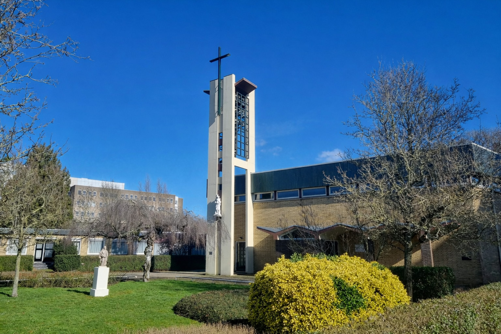

---
hide:
  - navigation
  - footer
  - toc
---
<link rel="stylesheet" href="https://cdnjs.cloudflare.com/ajax/libs/font-awesome/6.5.0/css/all.min.css">

<section class="english-page">

  

    <h1>Welcome</h1>
    
Parish of the Holy Martyrs of Gorcum &mdash; Gorinchem, the Netherlands

  

  

    
You have found the website of the Roman Catholic parish of the <strong>Holy Martyrs of Gorcum</strong>, located in Gorinchem. Visitors and pilgrims are always welcome to join our celebrations.

  

  

    <h2><i class="fa-solid fa-clock"></i> Mass times</h2>
    <ul class="mass-times">
      <li>Sunday11:00</li>
      <li>Wednesday10:00</li>
      <li>Friday10:00</li>
    </ul>
  

  

  

  

  
<i class="fa-solid fa-church"></i>

  <h2>Location &amp; contact</h2>
  

  

  <i class="fa-solid fa-location-dot"></i>
  

  Wijnkoperstraat 4 
  4204 HK Gorinchem 
  The Netherlands
  

  

  

  <i class="fa-solid fa-clock"></i>
  

  Parish office open: 
  Mondays and Fridays, 10:30 &ndash; 11:30
  

  

  

  <i class="fa-solid fa-phone"></i>
  

  <a href="tel:+31623902455">+31 6 2390 2455</a>
  

  

  

  <i class="fa-solid fa-envelope"></i>
  

  <a href="mailto:rkgorinchem@gmail.com">rkgorinchem@gmail.com</a>
  

  

  

  

  <iframe src="https://www.google.com/maps/embed?pb=!1m18!1m12!1m3!1d6774.472732088689!2d4.953610480970622!3d51.836837035663734!2m3!1f0!2f0!3f0!3m2!1i1024!2i768!4f13.1!3m3!1m2!1s0x47c68674a9a4f715%3A0xc7ba8945403b5c66!2sWijnkoperstraat%204%2C%204204%20HK%20Gorinchem!5e0!3m2!1sen!2snl!4v1770238834602!5m2!1sen!2snl"
  loading="lazy">
  </iframe>

  

  

  

    <h2><i class="fa-solid fa-cross"></i> Who are the Martyrs of Gorcum?</h2>
    
In 1572, nineteen Catholic clergymen priests, religious brothers, and laypeople from Gorinchem who were martyred for refusing to renounce their Catholic faith, in particular their belief in the Real Presence of Christ in the Eucharist and the authority of the Pope.

    
They were canonized by Pope Pius IX in 1867 and are venerated as the patron saints of our parish.

  

  

  This website is primarily in Dutch. For the full news, calendar and activities,
  please use your browser's translation feature, or <a href="/contact.html">contact us</a> directly.
  

</section>
